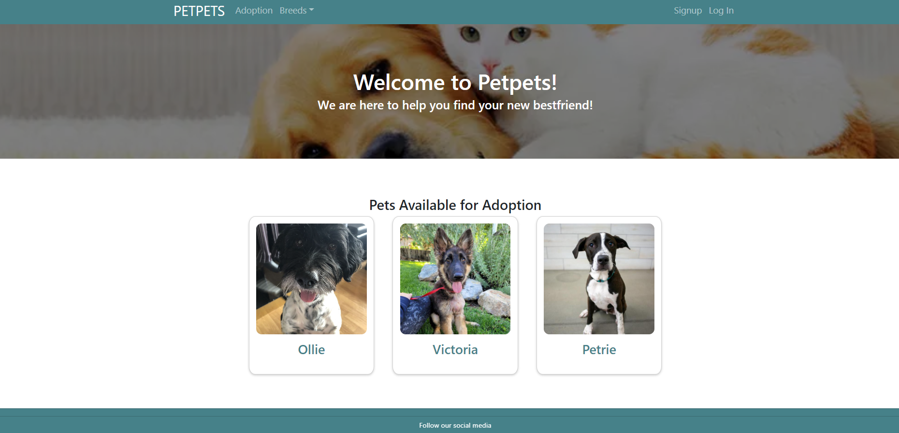
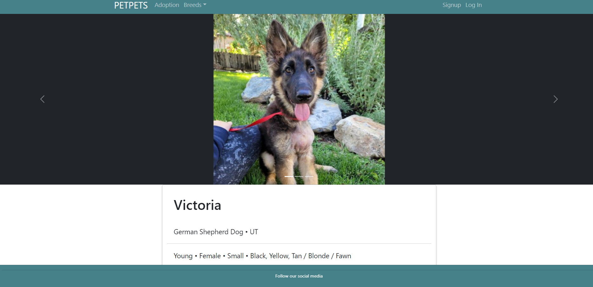

# PETPETS (Poject 3)

## Description
This application allows users to create a profile, search for domestic animals that are up for adoption in shelters in your area. You can search and save pets to your profile and begin the adotption application process. 

## Installation 
Run an npm i at the root level in your terminal

## Usage
run `npm run develop` at the root level in your terminal to start the application

## Screen Shots

## Contributors 
Joel higuera, https://github.com/joelhiguera

## Links
Github: https://github.com/Joelhiguera/petpets

Heroku: